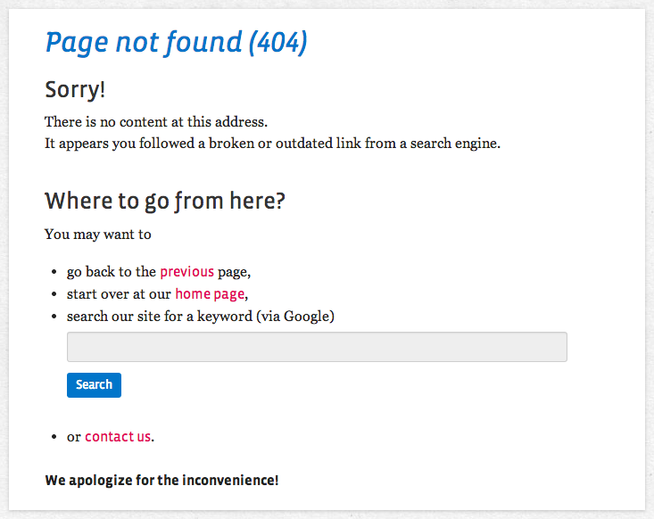

WebfactoryExceptionsBundle
==========================

[](https://travis-ci.org/webfactory/exceptions-bundle)
[](https://scrutinizer-ci.com/g/webfactory/exceptions-bundle/)
[](https://insight.sensiolabs.com/projects/f93a469f-1f3d-49f4-9282-bcee124b89de)

A bundle to simplify development of your custom, user-friendly Symfony error pages. Most useful in Symfony < 2.6.3.

_Why?_

Prior to Symfony 2.6.3, by default you would need to switch `kernel.debug` to `false` (most probably by using the ``app.php`` front controller and/or using the `prod` environment) in order to see the user-facing error pages. But this also requires you to clear the template cache every time you make a change to your error page template. Additionally, you won't get helpful error messages in case something goes wrong.

This bundle provides a simple way to view error pages for different HTTP status codes also in `kernel.debug` mode, so you can easily design them. It also contains some building blocks to help you get the job done.

Follow the [installation steps](#installation), [view your error pages](#viewing-your-error-pages) in action and then learn about the [predefined Twig blocks](#predefined-twig-blocks) for more user-friendly error pages.

Starting with Symfony 2.6.3 (2.6.0 - 2.6.2 had a bug in this regard), the [main functionality of this bundle moved to the Symfony core](http://symfony.com/blog/new-in-symfony-2-6-error-page-previews). You can still use the predefined Twig blocks, though.

Installation
------------

### Step 1) Get the bundle via Composer

Add the `exceptions-bundle` dependency by running the command (see http://getcomposer.org/):

    php composer.phar require webfactory/exceptions-bundle '@stable'

and run     

    php composer.phar install

### Step 2) Enable the bundle in your app kernel:

```php
<?php
// app/AppKernel.php

public function registerBundles()
{
    // ...
    $bundles[] = new Webfactory\Bundle\ExceptionsBundle\WebfactoryExceptionsBundle();
    // ...
}
```

### Step 3) Import the routing into your development routes:

```yaml
# app/config/routing_dev.yml

webfactory_exceptions:
    resource: "@WebfactoryExceptionsBundle/Resources/config/routing.yml"
```

Great - now let's have a look at your error pages.

**Note:** If you do not use the predefined Twig blocks, you could require and register the bundle for development environments only.


Viewing Your Error Pages
---------------------

Have you read the Symfony Cookbook section on 
[customizing the 404 page and other error pages](http://symfony.com/doc/current/cookbook/controller/error_pages.html#customizing-the-404-page-and-other-error-pages)?
Great! Then you know you should place your custom error page templates in `app/Resources/TwigBundle/views/Exception/errorX.html.twig`
and how Symfony determines which template to use.

Suppose you've just created an ``error404.html.twig`` template. To view this error page, go to:

    http://localhost/app_dev.php/_error/404

Of course, change ``http://localhost`` to the local URL of your app. In
fact, you can see the error page for any HTTP status code in any format,
thanks to the URL that this bundle gives you:

    /_error/{statuscode}/{format}
    
    
Predefined Twig Blocks
----------------------

WebfactoryExceptionsBundle also contains some Twig blocks we find useful to quickly create helpful, user friendly error pages.

Let's say your generic error page extends the base layout of MyWebsiteBundle. Then you may want to have your
`error.html.twig` to look something like this:

    {# error.html.twig #}
    
    

    
        {{ block('webfactory_exceptions_standardExceptionPage') }}
    

The `webfactory_exceptions_standardExceptionPage` block has headings, the translated exception description and provides
the user with a list of alternatives what they can do next: get back (simulating a browser back), get to the homepage,
get to the contact page or google the domain. It may look like this:



### Links to homepage and contact page

A default block in the bundle provides a link to the homepage with the default target `/`. If your application does not
start at `/`, you need to set the variable `homepageUrl`.

Also, you may want to set the variable `contactUrl` to get a link to your contact page in the listed alternatives.

    {# error.html.twig #}
    
    

    
    

    {# your blocks and definitions... #}

### Filling in blocks of base layouts

If your base layout already features blocks you need to fill with exception specific content, you can do it this way:

    {# error.html.twig #}
    

    

This loads the `webfactory_exceptions_error_title` block *directly* into the `title` block of your base layout, as well
as the `webfactory_exceptions_error_headline` block into the `stage_headline` block.

Happy error-styling!

Credits, Copyright and License
------------------------------

This bundle was started at webfactory GmbH, Bonn. It was inspired by the blog post [How Symfony2 turns exceptions into error pages and how to customize those](http://inside.webfactory.de/de/blog/symfony2-exception-handling-and-custom-error-pages-explained.html).

- <http://www.webfactory.de>
- <http://twitter.com/webfactory>

Copyright 2012-2014 webfactory GmbH, Bonn. Code released under [the MIT license](LICENSE).
