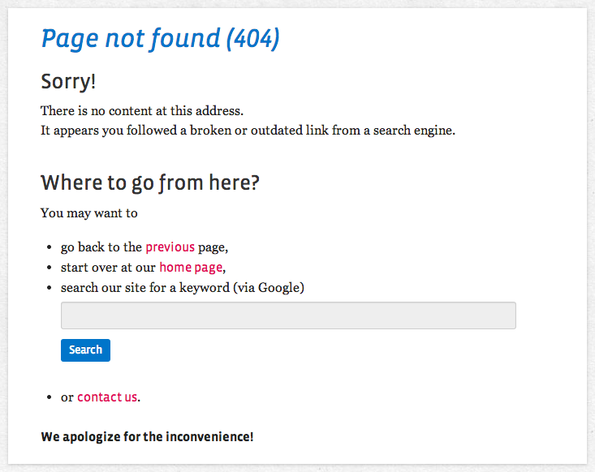

# WebfactoryExceptionsBundle

A Symfony Bundle with some Twig templates and blocks to create helpful, user friendly error pages.

## Basic Usage

First, follow the [Symfony Documentation](https://symfony.com/doc/current/controller/error_pages.html) to learn how to create and preview custom error pages. Been there, done that? Fine!

Let's say your generic error page extends the base layout of MyWebsiteBundle. Then you may want to have your
`error.html.twig` to look something like this:

    {# error.html.twig #}
    
    

    
        {{ block('webfactory_exceptions_standardExceptionPage') }}
    

The `webfactory_exceptions_standardExceptionPage` block has headings, the translated exception description and provides
the user with a list of alternatives what they can do next: get back (simulating a browser back), get to the homepage,
get to the contact page or google the domain. It may look like this:

## Links to Homepage and Contact Page

A default block in the bundle provides a link to the homepage with the default target `/`. If your application does not
start at `/`, you need to set the variable `homepageUrl`.

Also, you may want to set the variable `contactUrl` to get a link to your contact page in the listed alternatives.

    {# error.html.twig #}
    
    

    
    

    {# your blocks and definitions... #}

## Filling in Blocks of Base Layouts

If your base layout already features blocks you need to fill with exception specific content, you can do it this way:

    {# error.html.twig #}
    

    

This loads the `webfactory_exceptions_error_title` block *directly* into the `title` block of your base layout, as well
as the `webfactory_exceptions_error_headline` block into the `stage_headline` block.

Happy error-styling!

## Credits, Copyright and License

This bundle was started at webfactory GmbH, Bonn. It was inspired by the blog post [How Symfony2 turns exceptions into error pages and how to customize those](https://www.webfactory.de/blog/symfony2-exception-handling-and-custom-error-pages-explained).

Previous releases of this bundle contained extra code that would help during development to preview your error pages. This code, however, could be merged into the Symfony core in Symfony 2.6, so we could finally remove it from this bundle. Read the [announcement](https://symfony.com/blog/new-in-symfony-2-6-error-page-previews) when you're interested in historic details.

- <https://www.webfactory.de>
- <https://twitter.com/webfactory>

Copyright 2012-2022 webfactory GmbH, Bonn. Code released under [the MIT license](LICENSE).
